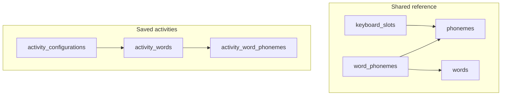

# Database schema

Source of truth: [`dal/schema.ts`](../dal/schema.ts). Migrations live under `drizzle/`.

The schema has two clusters:

1. **Shared reference** — phoneme inventory, classroom keyboard, and the teacher word bank.
2. **Saved activities** — named Wordle / Word Search configs with **frozen copies** of the words chosen at save time (not live links to the bank).

---

## Enums

### `activity_type`

| Value         | Use                                    |
| ------------- | -------------------------------------- |
| `wordle`      | Single-target phoneme Wordle activity  |
| `word_search` | Five-word phoneme Word Search activity |

### `difficulty`

| Value    | Use                                                                   |
| -------- | --------------------------------------------------------------------- |
| `easy`   | Easier presets (attempts / hints / grid size depend on activity type) |
| `medium` | Default builder difficulty                                            |
| `hard`   | Harder presets                                                        |

---

## `phonemes`

Canonical classroom phoneme inventory. One row per IPA symbol. Used by the student keyboard, word-bank editor palette, and normalized bank word membership.

| Column     | Type         | Use                                                                                          |
| ---------- | ------------ | -------------------------------------------------------------------------------------------- |
| `id`       | uuid PK      | Stable FK target for keyboard slots and bank word links                                      |
| `ipa`      | text, unique | IPA symbol without slashes (e.g. `θ`, `tʃ`, `iː`); lookup key when resolving typed sequences |
| `grapheme` | text         | Classroom letter label shown on keys and hints (e.g. `TH`)                                   |
| `example`  | text         | Cue text for hover hints (e.g. `as in thin`)                                                 |

---

## `keyboard_slots`

Physical layout of the on-screen phoneme keyboard (row/column grid). Seeded from the HCE keyboard; blank cells are allowed.

| Column       | Type                           | Use                                                                            |
| ------------ | ------------------------------ | ------------------------------------------------------------------------------ |
| `id`         | uuid PK                        | Row identity                                                                   |
| `row`        | integer                        | Zero-based grid row; unique together with `col`                                |
| `col`        | integer                        | Zero-based grid column; unique together with `row`                             |
| `phoneme_id` | uuid FK → `phonemes`, nullable | Phoneme on this key; **null** means a blank / spacer key. `ON DELETE SET NULL` |

---

## `words`

Teacher-managed **word bank**. Builders pick Wordle / Word Search targets from this list. Seeded with HCE words; teachers can add, edit, and delete via `/word-bank` or the builder modal.

| Column           | Type                     | Use                                                                    |
| ---------------- | ------------------------ | ---------------------------------------------------------------------- |
| `id`             | uuid PK                  | Public id exposed as `PhonemeWord.id` in the app                       |
| `english`        | text, unique             | Orthographic label shown to teachers and students; unique business key |
| `phoneme_length` | integer, check ∈ {3,4,5} | Denormalized phoneme count for fast Wordle length filters              |

---

## `word_phonemes`

Ordered membership of a bank word in the phoneme catalog (normalized link table).

| Column       | Type                 | Use                                                                                             |
| ------------ | -------------------- | ----------------------------------------------------------------------------------------------- |
| `id`         | uuid PK              | Row identity                                                                                    |
| `word_id`    | uuid FK → `words`    | Owning bank word; cascade delete with the word                                                  |
| `position`   | integer              | Zero-based order in the word; unique per `word_id`                                              |
| `phoneme_id` | uuid FK → `phonemes` | Catalog phoneme at this position; `ON DELETE RESTRICT` so catalog rows in use cannot be removed |

---

## `activity_configurations`

Named saved activity configs in the teacher library (create / select / rename / delete / export).

| Column          | Type              | Use                                                                                   |
| --------------- | ----------------- | ------------------------------------------------------------------------------------- |
| `id`            | uuid PK           | Activity identity                                                                     |
| `name`          | text              | Teacher-facing title (set via Save / Save as new / rename modals)                     |
| `activity_type` | enum              | `wordle` or `word_search`; drives word-count validation                               |
| `difficulty`    | enum              | Easy / medium / hard preset for the activity                                          |
| `show_hints`    | boolean           | Whether phoneme hover hints are enabled in play / HTML                                |
| `max_attempts`  | integer, nullable | Wordle guess limit; **null** for Word Search                                          |
| `seed`          | integer, nullable | Word Search grid RNG seed; **null** when not applicable or defaulted at generate time |
| `created_at`    | timestamptz       | Creation time (library sorting / audit)                                               |
| `updated_at`    | timestamptz       | Last save/rename time                                                                 |

---

## `activity_words`

**Snapshot** of the word(s) attached to a saved activity. Not a live FK to the word bank—editing or deleting a bank word must not break saved play or offline HTML.

- Wordle: exactly one row (`position` 0).
- Word Search: exactly five rows (`position` 0–4); unique English labels enforced in the DAL.

| Column        | Type                                | Use                                                                   |
| ------------- | ----------------------------------- | --------------------------------------------------------------------- |
| `id`          | uuid PK                             | Snapshot row id (used as `PhonemeWord.id` when loading this activity) |
| `activity_id` | uuid FK → `activity_configurations` | Owning config; cascade delete with the activity                       |
| `english`     | text                                | English label copied at save time                                     |
| `position`    | integer                             | Order within the activity; unique per `activity_id`                   |

---

## `activity_word_phonemes`

Denormalized phoneme sequence for an activity word snapshot **as of save time**. No FK to `phonemes`—values stay frozen if the catalog or bank word changes later.

| Column             | Type                       | Use                                                           |
| ------------------ | -------------------------- | ------------------------------------------------------------- |
| `id`               | uuid PK                    | Row identity                                                  |
| `activity_word_id` | uuid FK → `activity_words` | Owning snapshot word; cascade delete                          |
| `position`         | integer                    | Zero-based order in the target word; unique per activity word |
| `ipa`              | text                       | Copied IPA symbol (may be multi-character, e.g. `tʃ`)         |
| `grapheme`         | text                       | Copied classroom label for keys / hints                       |
| `example`          | text                       | Copied example cue for hints                                  |

---

## Why bank words and activity words are separate

|          | Word bank (`words` / `word_phonemes`) | Activity snapshots (`activity_words` / `activity_word_phonemes`) |
| -------- | ------------------------------------- | ---------------------------------------------------------------- |
| Lifetime | Shared, editable by teachers          | Owned by one saved config                                        |
| Phonemes | FK to `phonemes`                      | Inline `ipa` / `grapheme` / `example` copy                       |
| Purpose  | Authoring and pickers                 | Persistence and offline HTML integrity                           |

They are not two product “kinds” of word—only bank storage vs frozen copies at save time.
